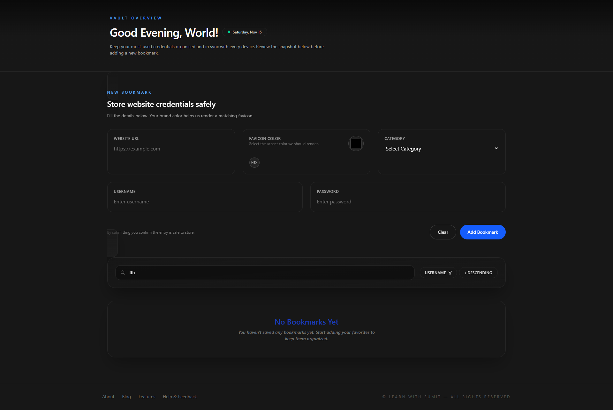
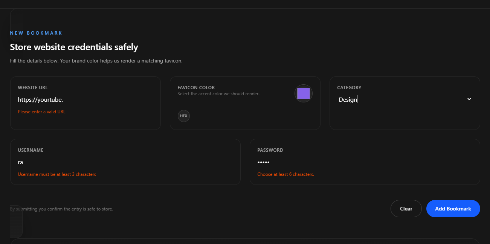
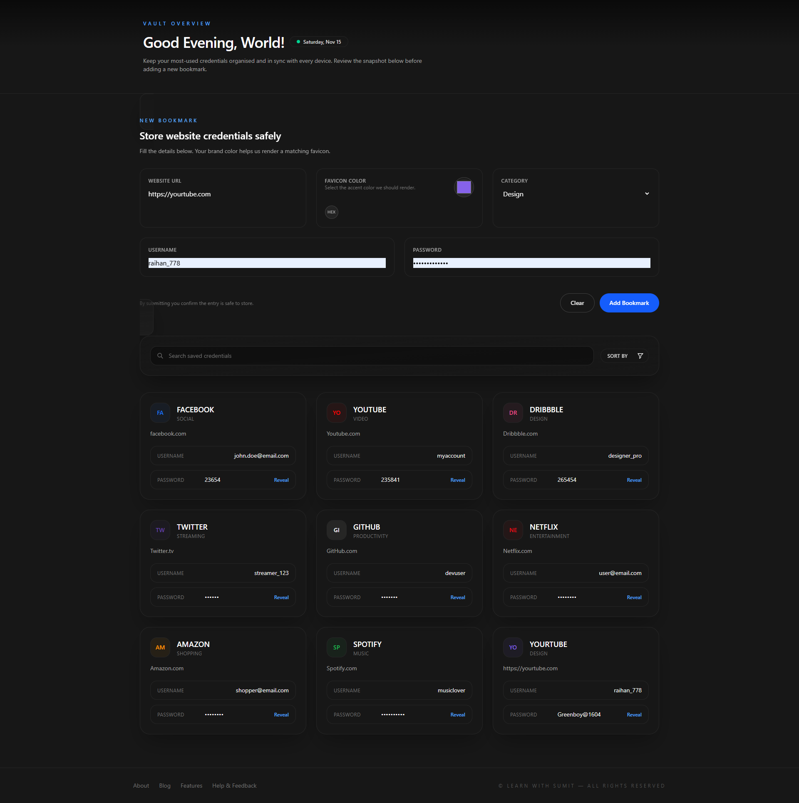
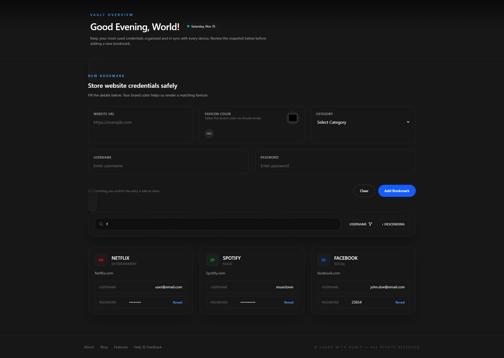
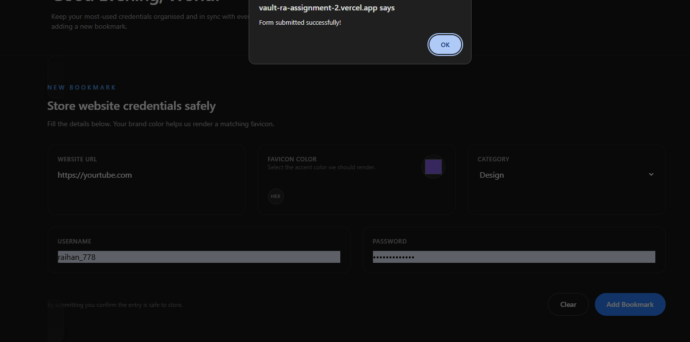

# 📘 Bookmark Manager — React + TailwindCSS

A simple, elegant, and fully functional **Bookmark Manager Application** built using **React (Vite)** and **TailwindCSS**.  
This project converts a provided HTML template into a React-based, component-driven architecture while implementing form handling, validation, search, filtering, sorting, password reveal toggle, and dynamic greeting features.

---

## 🚀 Live Demo

_(https://vault-ra-assignment-2.vercel.app/)_

---

## 🖼️ Screenshots

_(Add screenshots here)_








---

## ✨ Features Overview

### 🔹 1. Dynamic Greeting

- Displays greeting based on time:
  - Morning → “Good Morning”
  - Afternoon→ “Good Afternoon”
  - Evening → “Good Evening”
- Shows date in **Day, Mon DD** format (e.g., Monday, Nov 10).

---

### 🔹 2. New Bookmark Form

- Add bookmarks with:
  - Website URL
  - Category
  - Username
  - Password
    -color
- **Full validation includes:**
  - Required fields
  - Valid URL
  - Password ≥ 6 characters
- **Field-level error messages**
- **Clear button** resets the form
- Auto-generates **Website Name** **Brand Icon** from the URL

---

### 🔹 3. Bookmark Cards (Grid View)

- Responsive grid view of bookmarks
- Each card shows:
  - Name
  - URL
  - Category
  - Username
  - Password (masked)
- Custom icon:
  - Based on first **two domain characters**
  - Uses selected category color
- Password reveal/hide toggle

---

### 🔹 4. Search Functionality

- Real-time search matching:
  - username
  - URL
- Empty search → show all bookmarks
- No result → shows a themed **“Not Found”** message

---

### 🔹 5. Sorting Feature

- Sort bookmarks by:
  - **url (ASC / DESC)**
  - **username (ASC / DESC)**
- Interactive "Sort By" dropdown UI

---

### 🔹 6. Component-Based Architecture

- Organized by features:
  - Form
  - Grid
  - Card
  - Search
  - Sorting
  - Utilities
- Clean, logical structure
- No third-party UI/utility libraries
- No unnecessary design changes

---

## 🛠️ Tech Stack

- **React (Vite)**
- **TailwindCSS**
- **JavaScript (ES6)**
- **Local State (useState)**

---

## 📦 Installation & Setup

### 1️⃣ Create Vite Project

```bash
npm create vite@latest
```

### 2️⃣ Install Dependencies

```bash
npm install
```

### 3️⃣ Install TailwindCSS

```bash
npm install tailwindcss @tailwindcss/vite

```

Add Tailwind directives:

```css
@import "tailwindcss";
```

### 4️⃣ Start Dev Server

```bash
npm run dev
```

---

## 📁 Recommended Folder Structure

```
VAULT-RA-ASSIGNMENT-2

├── src/
│   ├── assets/
│   └── vaultContainer/
│       ├── BookMarkCard.jsx
│       ├── NoBookMarkCard.jsx
│       ├── VaultAction.jsx
│       └── VaultContainer.jsx
│   ├── App.css
│   ├── App.jsx
│   ├── AuthForm.jsx
│   ├── Footer.jsx
│   ├── Header.jsx
│   ├── index.css
│   └── main.jsx
├── .gitignore
├── eslint.config.js
├── index.html
├── package-lock.json
├── package.json
├── README.md
└── vite.config.js
```

---

## 🧠 Key Logics

### 🔹 URL → Name Extraction

Automatically converts URL domain into a user-friendly name.

### 🔹 Custom Sorting

Pure JavaScript sorting — no libraries used.

### 🔹 Password Reveal Toggle

Toggles visibility between `"password"` and `"text"`.

---

## 📄 Assignment Requirements (Completed)

✔ Vite + React project created  
✔ TailwindCSS installed  
✔ HTML converted to React  
✔ Dynamic greeting + formatted date  
✔ Form with full validation  
✔ Bookmark creation  
✔ Auto name from URL  
✔ Password reveal toggle  
✔ Search feature  
✔ “Not Found” message  
✔ Sorting (Name/Date, Asc/Desc)  
✔ Clear button resets form  
✔ Organized components  
✔ No external libraries  
✔ Professional README

---

## 👨‍💻 Author

**Your Name**  
Raihan Uddin
Email:raihanarif778@gmail.com  
GitHub: your-github-raihan-778
